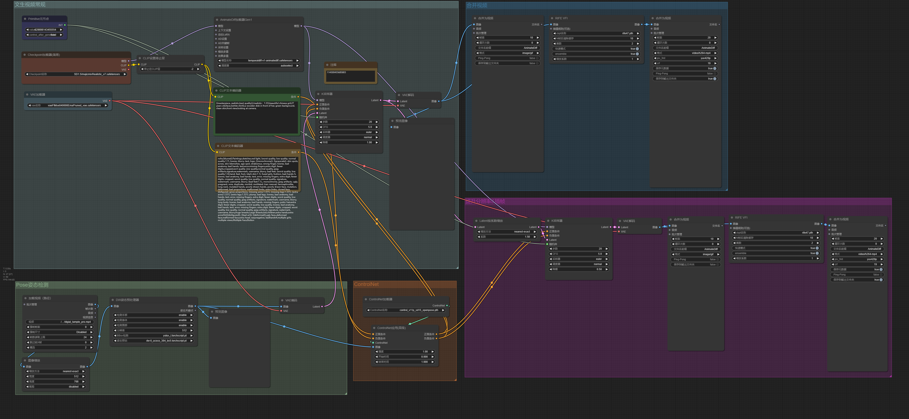
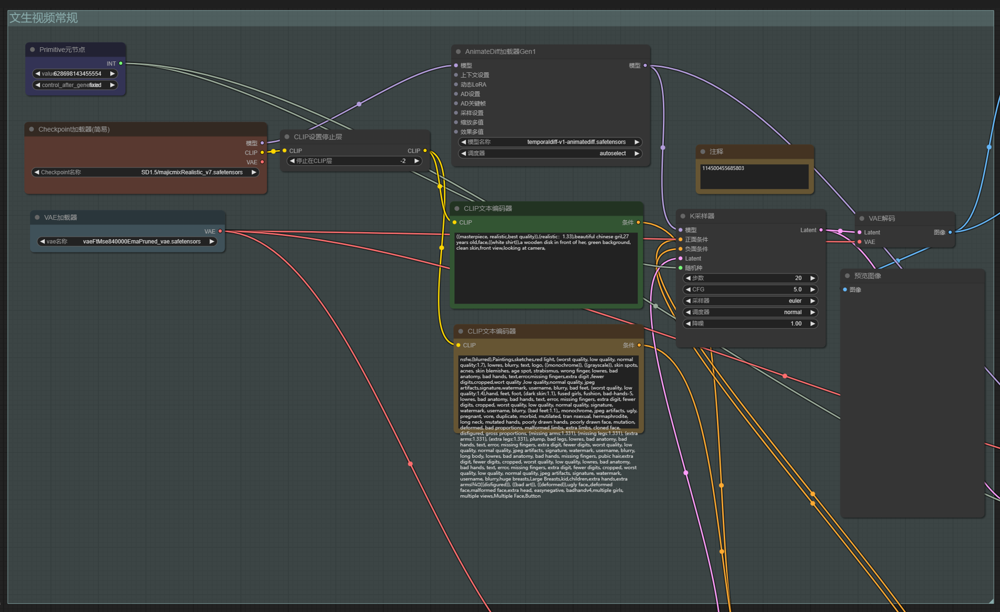
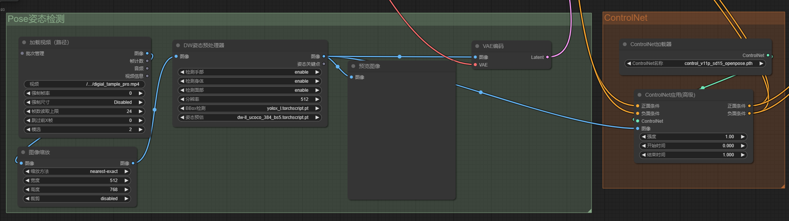
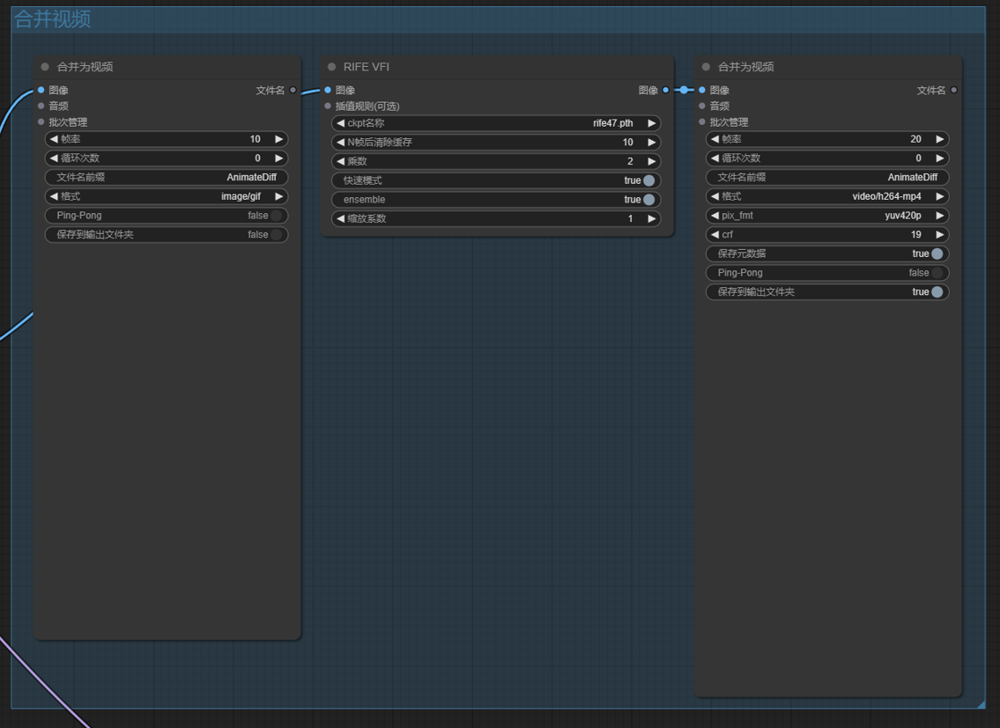
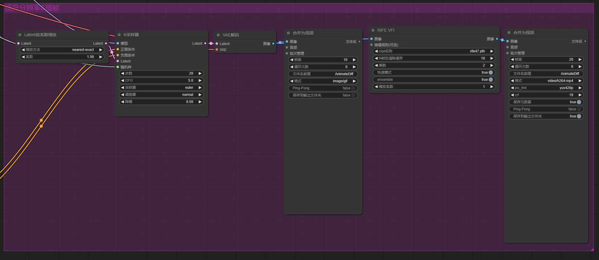

# ComfyUI 使用文档

## 工作流

如果您已经有 ComfyUI 的环境，可以直接使用我的工作流：

<p align="center">
  
</p>


## 功能点

我的 Workflow 具有以下功能点：

- 生成人像图
- DW Pose 生成骨骼图
- ControlNet 控制人物姿态
- AnimateDiff 生成视频
- 插帧提升帧率
- 提升分辨率

## 环境搭建

```bash
git clone https://github.com/comfyanonymous/ComfyUI.git
pip install -r requirements.txt
```

测试安装

```bash
cd ComfyUI
python main.py
```

## 模型下载

执行脚本 `python download_models.py` 即可下载本项目需要用到的全部权重

## 插件安装

1. 首先需要手动拉取下【插件管理器】

```bash
cd ComfyUI/custom_nodes
git clone https://github.com/ltdrdata/ComfyUI-Manager.git
```

2. 重启 ComfyUI

3. 刷新页面，点击右下角 【管理器】->【安装缺失节点】即可。

以下是我用到的插件：

|            插件名             |            用途            |
| :---------------------------: | :------------------------: |
| AIGODLIKE-COMFYUI-TRANSLATION |          中文翻译          |
|  ComfyUI-Advanced-ControlNet  |  ContralNet 工具包升级版   |
|  ComfyUI-AnimateDiff-Evolved  |    AnimateDiff 动画生成    |
|       ComfyUI-Crystools       |        机器资源监控        |
|    ComfyUI-Custom-Scripts     |          模型管理          |
|  ComfyUI-Frame-Interpolation  |            插帧            |
|      ComfyUI-Impact-Pack      |                            |
|        ComfyUI-Manager        |     插件管理器（必备）     |
|   ComfyUI-VideoHelperSuite    |         视频加载器         |
|       ComfyUI_FizzNodes       |                            |
|    ComfyUI_IPAdapter_plus     |     IPAdapter 风格迁移     |
| comfyui-portrait-master-zh-cn | 人物生成中文提示词辅助工具 |
|   comfyui-workspace-manager   |        工作流管理器        |
|    comfyui_controlnet_aux     |     ContralNet 工具包      |
|   comfyui_segment_anything    |         SAM 工具包         |
|      sdxl_prompt_styler       |        SDXL 工具包         |

## Workflow 详解

### 1. 生成人像图

<p align="center">
  
</p>

首先我们来说下基本的文生图流程，首先加入 sd checkpoint ，和 vae 模型，vae 可选，但 sd 是必须的，如果觉得我这个模型不好，可以自行去 c站 找大佬微调好的模型，

填写好正向词和反向词，接个 Ksampler 就可以生成人像了

### 2. DW Pose 生成骨骼图 & ControlNet 控制人物姿态

<p align="center">
  
</p>

人物生成好了，下一步要生成特定的动作的话，有时候语言很难描述，我们需要借助 controlnet 来结合  pose 的姿态图来让 sd 生成特定动作的任务，这就是左下角的作用

### 3. AnimateDiff 生成视频

<p align="center">
  
</p>

这两块搞好之后，可以看到任务以特定的动作生成了，下面，我们加入动作，用到的算法是 Animatediff 简单的串起来，就可以了

### 4. 插帧提升帧率

<p align="center">
  
</p>

我们把生成的图片合成为视频，原始是 8帧，我们对它进行一个插帧，让视频更加丝滑，这就是右上角的功能

### 5. 提升分辨率

<p align="center">
  
</p>

因为 SD 1.5 默认的输出是 512 x 512，我们还要做个 scale ，让分辨率高一点，这就是右下角的功能。

## 配置视频路径

生成好了 mp4 我们就可以修改下配置 [web_configs](../../utils/web_configs.py#L78) 中的 `DIGITAL_HUMAN_VIDEO_PATH` 参数，后续就会用这个视频来生成口型了。

```diff
- DIGITAL_HUMAN_VIDEO_PATH: str = r"./doc/digital_human/lelemiao_digital_human_video.mp4"
+ DIGITAL_HUMAN_VIDEO_PATH: str = r"新生成的 mp4 路径"
```


## 开发参考网站

- 模型下载网站：C站：https://civitai.com
- 提示词网站：https://promlib.com/
- 工作流：https://openart.ai/workflows/home
- 插件排行：https://www.nodecafe.org/
